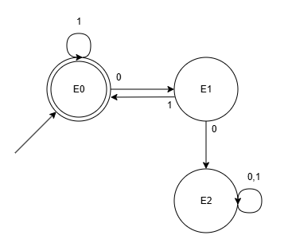
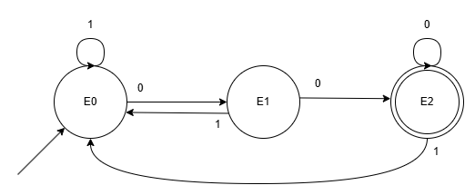
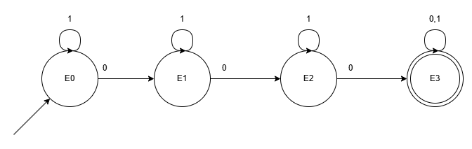
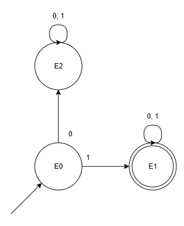
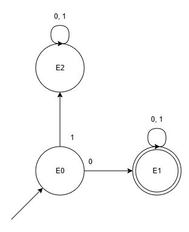

# Informações

**Aluno: Vinícius Costa Pan**

**Data: 27/04/2026**

# Questões

1. Faça os diagramas de transição de Máquinas de Estados Finitos Determinísticas (MEFD-0, MEFD-1, MEFD-2, MEFD-3, MEFD-4) para reconhecer cada uma das seguintes linguagens:

   a. **L0** = {x | x ∈ {0,1}* e cada 0 em x é seguido por pelo menos um 1}  
   Exemplos: `010111`, `1111`, `01110111011`

   

   b. **L1** = {x | x ∈ {0,1}* e x termina com 00}

   

   c. **L2** = {x | x ∈ {0,1}* e x contém exatamente 3 zeros}

   

   d. **L3** = {x | x ∈ {0,1}* e x inicia com 1}

   

   e. **L4** = {x | x ∈ {0,1}* e x não começa com 1}

   

 

2. Implemente, utilizando a linguagem C, C++ ou Python, um programa capaz de simular cada uma destas máquinas. Observe que a simulação precisa ser da máquina (estados e transições), e não de um programa equivalente.

     Realizar a compilação e execução do código presente nesse repositório por meio do comando `make main` (caso possua a ferramenta de uso de makefile) ou os comandos `g++ -o main src/main.cpp src/states.cpp` e `./main.exe`

 

3. Explique a hierarquia de Chomsky para as gramáticas, destacando as características de cada uma, notadamente no que se refere às limitações impostas à criação de regras de produção.

   Importante: você precisa explicar a formação das regras de produção para cada uma das gramáticas na hierarquia de Chomsky com exemplos práticos.
